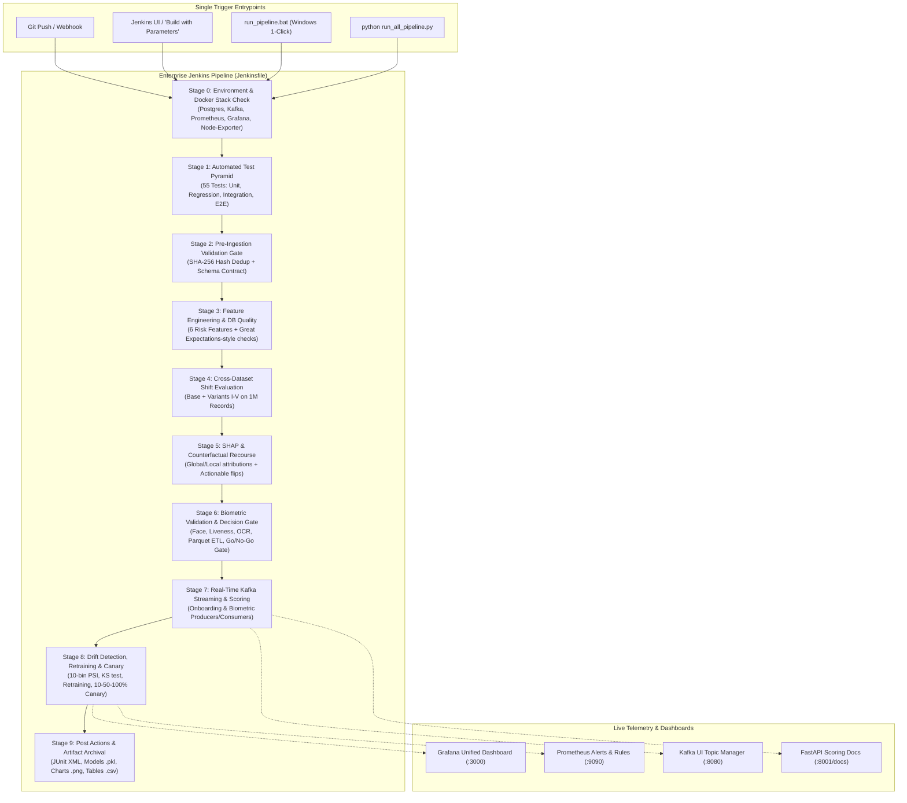

# Enterprise Jenkins CI/CD & Single-Trigger Pipeline Guide
## KYC Behavioral Observability Framework for Early Risk Assessment in Onboarding
**Student:** Pranali Pandharinath Supekar (ID: 2024DA04387)  
**Program:** M.Tech Data Science & Engineering, BITS Pilani WILP  
**Mentor:** Prof. A. Abdul Rahman, BITS Pilani WILP  
**Supervisor:** Srinivas Rao Marripelli, Technical Lead, TCS  
**Repository:** `Pranali3499/KYC-Observability`  

---

## 📌 1. Executive Summary & Evaluator Alignment

In production MLOps and financial fraud observability, a multi-component machine learning system cannot rely on manual, multi-step CLI executions. The evaluator recommended:
1. **Single-Trigger Orchestration:** Consolidating all data ingestion, feature engineering, model training, biometric validation, streaming scoring, drift detection, and canary deployment into a **single command / single click**.
2. **Jenkins CI/CD & Continuous Training (CT):** Establishing an industry-standard Declarative Jenkins Pipeline (`Jenkinsfile`) capable of triggering, validating, testing, and archiving artifacts automatically on code changes or drift alerts.

This repository provides **four unified ways to trigger the entire pipeline with a single action**:
- **Windows Single Click:** `run_pipeline.bat` (or `run_pipeline.bat fast`)
- **Linux/macOS Single Command:** `./run_pipeline.sh` (or `./run_pipeline.sh fast`)
- **Python CLI Orchestrator:** `python run_all_pipeline.py --mode full`
- **Enterprise Jenkins Pipeline:** Declarative `Jenkinsfile` running in Jenkins with Blue Ocean visual telemetry and JUnit reports.

---

## 🏗️ 2. End-to-End Pipeline Architecture



---

## 🚀 3. How to Run the Pipeline with a Single Trigger

### Method 1: Windows 1-Click Master Runner (`run_pipeline.bat`)
Simply double-click `run_pipeline.bat` or run in terminal:
```cmd
# Full production run (evaluates Base + 5 Variants, 55 tests, SHAP, Biometrics, Kafka, Drift):
run_pipeline.bat

# Fast demonstration run (~2 mins for live viva presentation):
run_pipeline.bat fast
```

### Method 2: Linux / macOS / Unix Runner (`run_pipeline.sh`)
```bash
chmod +x run_pipeline.sh

# Run full pipeline:
./run_pipeline.sh full

# Run fast demo pipeline:
./run_pipeline.sh fast
```

### Method 3: Python Master Orchestrator (`run_all_pipeline.py`)
```bash
# Full execution
python run_all_pipeline.py --mode full

# Fast viva execution (~2 minutes)
python run_all_pipeline.py --mode fast

# CI test suite only (unit tests & static validation)
python run_all_pipeline.py --mode ci

# Skip docker start if containers are already running
python run_all_pipeline.py --mode fast --skip-docker
```

---

## ⚙️ 4. Enterprise Jenkins Pipeline (`Jenkinsfile`) Details

The root [`Jenkinsfile`](file:///d:/kyc-observability/Jenkinsfile) is written in Declarative Pipeline syntax and natively supports both Windows and Linux build nodes (`isUnix()` conditional execution).

### Pipeline Parameters
When selecting **Build with Parameters** in Jenkins, the following options are available:
| Parameter | Type | Default | Description |
|---|---|---|---|
| `PIPELINE_MODE` | Choice | `FAST_DEMO` | `FAST_DEMO` (~2 mins), `FULL_PRODUCTION` (1M rows), or `CI_UNIT_ONLY` |
| `SIMULATE_DRIFT_AND_RETRAIN` | Boolean | `true` | Injects synthetic drift and executes automated candidate model retraining |
| `CANARY_ROLLOUT` | Boolean | `true` | Simulates progressive 10% $\rightarrow$ 50% $\rightarrow$ 100% traffic shift with health check gates |

---

## 📊 5. Jenkins Stage Breakdown & Failure Gates

| Stage | Script Executed | Gate / Pass Criteria | Action on Failure |
|---|---|---|---|
| **0. Infrastructure Check** | `docker compose up -d` | 6 Docker containers running (PostgreSQL, Kafka, Kafka UI, Prometheus, Grafana, Node-Exporter) | Warn / Log stack state |
| **1. Test Pyramid** | `pytest tests/ -v --junitxml=...` | **100% pass rate (55/55 tests)** | **Hard Stop (Exit 1)** |
| **2. Pre-Ingestion Gate** | `pre_ingestion_validator.py` | Schema contract valid, nulls < 1%, SHA-256 deduplication passed | **Hard Stop (Exit 1)** |
| **3. Feature Engineering & Quality** | `feature_engineering.py`<br/>`data_quality_checks.py` | 6 risk features derived, valid ranges, DB constraints satisfied | **Hard Stop (Exit 1)** |
| **4. Cross-Dataset Evaluation** | `cross_dataset_evaluation.py` | Base + Variants I to V evaluated, PSI < 0.05 vs reference | Log shift metrics to MLflow |
| **5. Explainability & Recourse** | `shap_explainability.py`<br/>`counterfactual_analysis.py` | Global/Local attributions computed; flip distance calculated | Archive SHAP summary plot |
| **6. Biometric Decision Gate** | `biometric_face_matching.py`<br/>`verify_biometric_go_no_go.py` | Face AUC $\ge 0.65$, FAR $\le 5\%$, Combined Parquet generated $\rightarrow$ **`[GO]` status** | **Hard Stop if `[NO-GO]`** |
| **7. Real-Time Kafka Streaming** | `kafka_producer.py`<br/>`kafka_consumer_etl.py`<br/>`kafka_biometric_producer.py`<br/>`kafka_biometric_consumer_etl.py` | End-to-end messaging, feature extraction, scoring & PostgreSQL persistence | Warn on timeout / connection drop |
| **8. Drift & Canary Rollout** | `drift_detection.py`<br/>`retraining_pipeline.py`<br/>`canary_rollout_simulator.py` | PSI/KS tests evaluated; if PSI > 0.25, retrain candidate model; pass 10% $\rightarrow$ 50% $\rightarrow$ 100% canary gates | Automated Canary Rollback on error spike |
| **9. Post Actions & Archival** | Jenkins `post { always/success }` | Publish JUnit XML, archive model files (`.pkl`), plots (`.png`), summaries (`.csv`) | Notify build status |

---

## 🐳 6. Running Local Jenkins Server (Viva Demo Setup)

If you wish to demonstrate a live Jenkins UI to the evaluator:

1. **Start the Jenkins container:**
   ```bash
   docker compose -f docker-compose.jenkins.yml up -d
   ```
2. **Retrieve the initial admin password:**
   ```bash
   docker exec -it kyc-jenkins cat /var/jenkins_home/secrets/initialAdminPassword
   ```
3. **Open in browser:** `http://localhost:8088`
4. **Create a Pipeline Job:**
   - Click **New Item** $\rightarrow$ Enter `KYC-Observability-Pipeline` $\rightarrow$ Select **Pipeline**.
   - Under **Pipeline Definition**, select **Pipeline script from SCM** $\rightarrow$ Git (or point to local repository).
   - Script Path: `Jenkinsfile`.
   - Click **Save** and **Build Now**!

---

## 🎯 7. Viva Defense: How to Answer the Evaluator

### Q1: *"Why did you create a single-trigger script and how does Jenkins orchestrate it?"*
> **Answer:** *"In enterprise production systems, machine learning models do not run in isolation. A complete MLOps lifecycle spans data validation, feature computation, model inference, biometric gating, streaming ingestion, drift monitoring, retraining, and canary rollouts. We created `run_all_pipeline.py` and `run_pipeline.bat`/`run_pipeline.sh` as a single-trigger master runner so that the entire pipeline can execute deterministically with one command. For CI/CD, we created a Declarative `Jenkinsfile` that maps all 9 architectural layers into discrete stages, providing automated test pyramid verification (JUnit XML), model artifact archiving, and continuous training automation."*

### Q2: *"What happens in the Jenkins pipeline if data drift is detected or a quality gate fails?"*
> **Answer:** *"The pipeline enforces strict fail-safe gates at multiple layers:
> 1. **Pre-Ingestion Gate:** If schema contracts fail or null rates exceed 1%, `pre_ingestion_validator.py` halts execution immediately.
> 2. **Biometric Gate:** If Face Matching AUC drops below 0.65 or FAR exceeds 5%, `verify_biometric_go_no_go.py` asserts a `[NO-GO]` state and fails Stage 6.
> 3. **Drift & Retraining Gate:** In Stage 8, `drift_detection.py` computes 10-bin PSI and 2-sample KS statistics. If PSI exceeds 0.25, it automatically triggers `retraining_pipeline.py` to fit a candidate model and validates it against `canary_rollout_simulator.py` (10% $\rightarrow$ 50% $\rightarrow$ 100% traffic progression) before promoting the model."*

### Q3: *"How does your Jenkins pipeline differ from GitHub Actions?"*
> **Answer:** *"Both use declarative pipeline-as-code principles. GitHub Actions (`.github/workflows/ci.yml` and `tests.yml`) serves as our lightweight SaaS CI gate for automated unit testing, regression testing, and syntax verification on pull requests. Jenkins (`Jenkinsfile`), on the other hand, acts as our full enterprise-grade Continuous Training (CT) and Continuous Deployment (CD) orchestrator with live Docker integration (PostgreSQL, Kafka, Prometheus), parameterized execution (`FAST_DEMO` vs `FULL_PRODUCTION`), and model artifact lifecycle management."*
